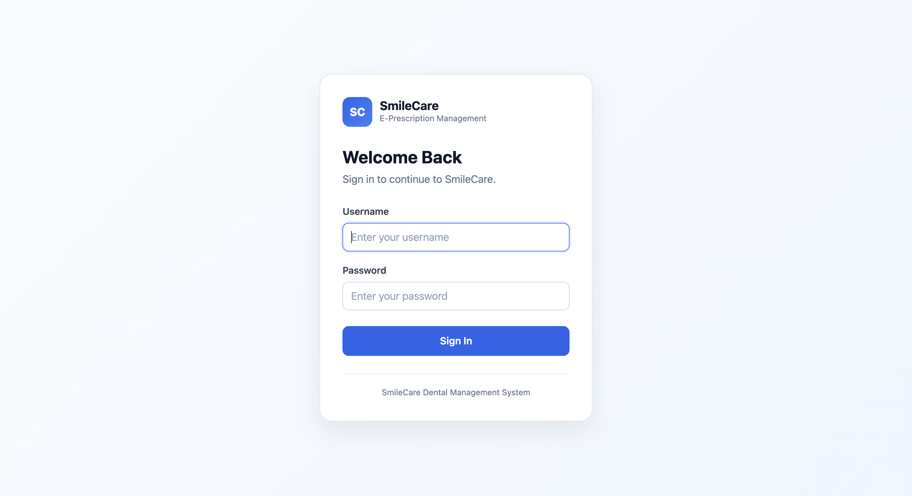
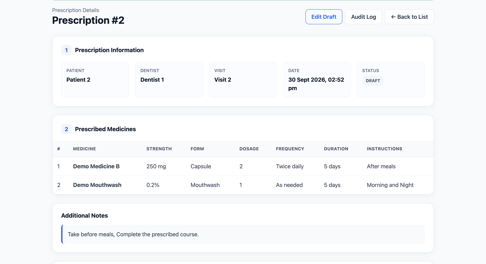
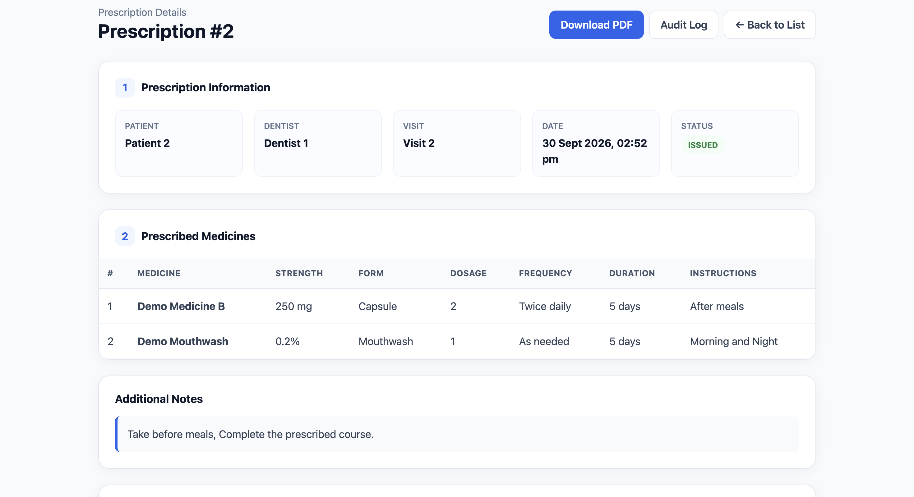
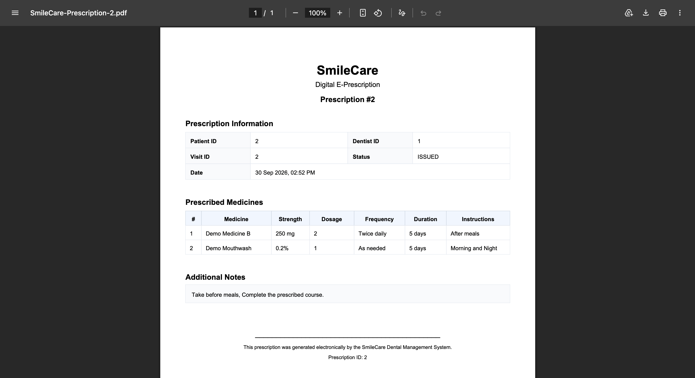
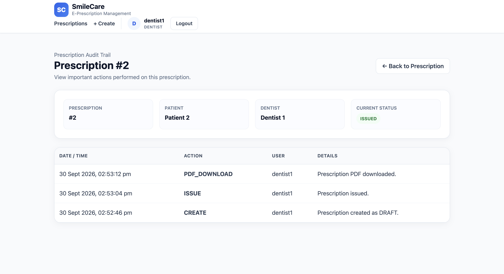

# SmileCare – E-Prescription Management System

SmileCare is a web-based dental management system developed using Java and Spring Boot. This repository focuses on the **E-Prescription Management** module, which allows dentists to create, manage, issue, and track digital prescriptions for patients.

This module was developed as part of the **SE2030 Software Engineering** group project.

## Overview

The E-Prescription Management module provides a structured way to manage dental prescriptions digitally.

Dentists can create prescriptions, add multiple medicines, save prescriptions as drafts, edit draft prescriptions, issue completed prescriptions, review patient-related information, generate prescription PDFs, and track important prescription activities through audit logs.

Patients and reception staff can access prescription information according to their permitted roles.

## Key Features

- Secure user authentication
- Role-based access control
- Create digital prescriptions
- Add multiple medicines to a prescription
- Record dosage, frequency, duration, and instructions
- Save prescriptions as drafts
- Edit draft prescriptions
- Issue completed prescriptions
- Cancel prescriptions
- View prescription history
- Patient-specific prescription access
- Patient medical alert visibility
- Generate downloadable prescription PDFs
- Prescription activity audit logging
- Controlled access for dentists, patients, and receptionists

## User Roles

### Dentist

Dentists can:

- Create prescriptions
- Add medicine and dosage information
- Save prescriptions as drafts
- Edit draft prescriptions
- Issue prescriptions
- Cancel prescriptions
- Review patient medical alerts
- View prescription details and history
- Generate prescription PDFs
- View prescription audit logs

### Patient

Patients can:

- Log in securely
- View their own prescription history
- View issued prescriptions
- View cancelled prescriptions
- Access permitted prescription information

### Receptionist

Receptionists can:

- View permitted prescription records
- Access prescription information required for patient support
- Assist with prescription viewing and printing where permitted

## Prescription Workflow

The main prescription workflow is:

**Dentist Login → Select Patient → Review Patient Information → Create Prescription → Add Medicines → Save Draft → Edit if Required → Issue Prescription → Generate PDF → Audit Activity**

Prescription statuses include:

- `DRAFT`
- `ISSUED`
- `CANCELLED`

Issued prescriptions are retained as records instead of being permanently deleted.

## Technology Stack

### Backend

- Java
- Spring Boot
- Spring MVC
- Spring Data JPA
- Spring Security
- Hibernate

### Frontend

- Thymeleaf
- HTML5
- CSS3

### Database

- MySQL

### Development Tools

- IntelliJ IDEA
- MySQL Workbench
- Maven
- Git
- GitHub

### Additional Library

- OpenPDF for prescription PDF generation

## Project Architecture

The application follows a layered Spring Boot architecture.

Main packages include:

- `config`
- `controller`
- `dto`
- `entity`
- `integration`
- `repository`
- `security`
- `service`

This structure separates application responsibilities and makes the system easier to maintain and extend.

## Main Entities

### Prescription

Stores the main prescription information, including:

- Patient ID
- Dentist ID
- Visit ID
- Prescription date
- Notes
- Prescription status

### Prescription Item

Stores each medicine included in a prescription.

Each item contains:

- Medicine
- Dosage
- Frequency
- Duration
- Instructions

### Medicine

Stores medicine-related information, including:

- Medicine name
- Strength
- Form
- Active status

### Patient Medical Alert

Stores patient information that may be useful to the dentist before creating a prescription.

Examples include:

- Allergies
- Medical history

### Prescription Audit Log

Records important prescription activities such as:

- `CREATE`
- `UPDATE`
- `ISSUE`
- `CANCEL`
- `PDF_DOWNLOAD`

### App User

Stores authentication and role-related information used by Spring Security.

## Security

The application uses **Spring Security** for authentication and role-based authorization.

Supported roles include:

- `DENTIST`
- `PATIENT`
- `RECEPTIONIST`

Database passwords are not stored directly in the public repository.

The MySQL password is supplied using an environment variable.

## Database Configuration

The default MySQL database name is:

`smilecare_db`

The application supports the following environment variables:

- `DB_URL`
- `DB_USERNAME`
- `DB_PASSWORD`

The database password should be provided through `DB_PASSWORD` instead of being committed directly to GitHub.

## How to Run the Project

### 1. Clone the Repository

Clone the repository to your local computer.

### 2. Open the Project

Open the project using IntelliJ IDEA or another Java IDE with Maven support.

### 3. Configure MySQL

Create a MySQL database named:

`smilecare_db`

Create or configure a MySQL user with permission to access the database.

### 4. Configure the Database Password

Set the following environment variable:

`DB_PASSWORD`

When using IntelliJ IDEA, this can be configured through:

**Run → Edit Configurations → Environment Variables**

### 5. Run the Application

Run:

`SmilecareApplication.java`

After the application starts successfully, open:

`http://localhost:8080`

## Demo Users

The development version contains demo users for testing the available roles.

- Dentist: `dentist1`
- Patient: `patient1`
- Receptionist: `reception1`

These accounts are intended only for development and demonstration purposes.

## Screenshots

### Login Page

### Draft Prescription

This screen shows a prescription saved in `DRAFT` status before it is issued.

### Issued Prescription

After the prescription is issued, the status changes to `ISSUED` and the prescription PDF becomes available.

### Generated E-Prescription PDF

The system can generate a digital prescription containing patient, dentist, visit, medicine, dosage, frequency, duration, and instruction information.

### Prescription Audit Trail

Important prescription actions are recorded in the audit trail, including prescription creation, issuing, and PDF downloads.

## Current Development Status

The E-Prescription Management module currently supports:

- Authentication
- Role-based authorization
- Prescription creation
- Multiple medicines per prescription
- Draft prescription management
- Prescription editing
- Prescription issuing
- Prescription cancellation
- Patient prescription history
- Patient medical alert visibility
- PDF generation
- Prescription audit logging

The current version also contains temporary integration support for patient, dentist, and visit references.

These references can be connected to the final group-level Patient Management, Appointment Management, and Electronic Medical Record modules during full system integration.

## Future Improvements

Possible future improvements include:

- Full Patient Management integration
- Full Appointment Management integration
- Electronic Medical Record integration
- Advanced medicine management
- Prescription search and filtering
- Dashboard and reporting
- Patient notifications
- Improved PDF design
- Additional validation rules
- Expanded audit reporting
- Cloud deployment

## Project Context

SmileCare is a group-based dental management system.

Different system functions are developed by different members of the project team.

This repository mainly demonstrates the **E-Prescription Management** functionality.

## Academic Context

**Module:** SE2030 – Software Engineering

**Project:** SmileCare – Web-based Dental Management System

**Major Function:** E-Prescription Management

## Author

**Imal Karshana**

Software Engineering Undergraduate

GitHub: `IT25103849`

## Disclaimer

This application is an academic software engineering project developed for educational and demonstration purposes.

The patient information, medicines, medical alerts, and prescription records used during development are demo/test data.

This application is not intended to be used as a production medical prescribing system without additional clinical validation, security review, legal compliance, and integration with verified healthcare data sources.
